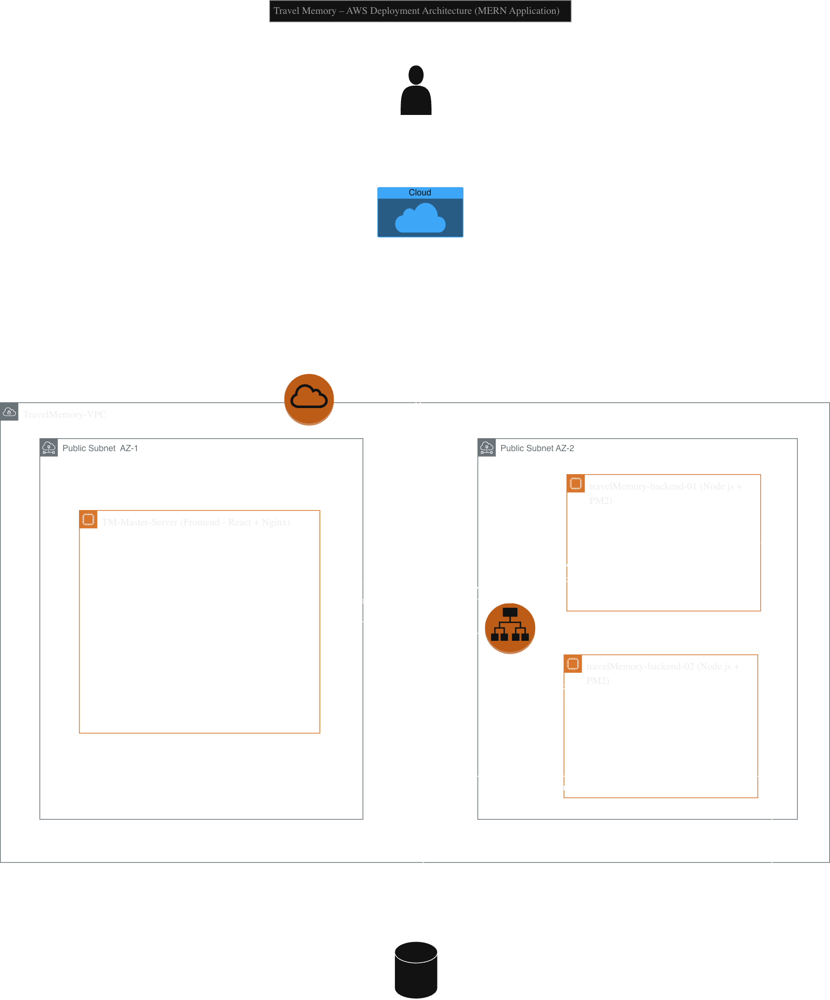

## 🧱 AWS Deployment Architecture Diagram

The following diagram shows the AWS deployment architecture for the Travel Memory application, including VPC, subnets, EC2 instances, Application Load Balancer, Cloudflare integration, and MongoDB Atlas.

